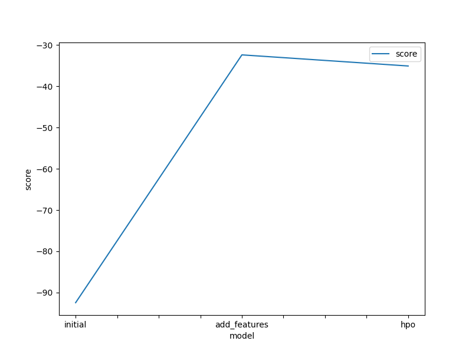
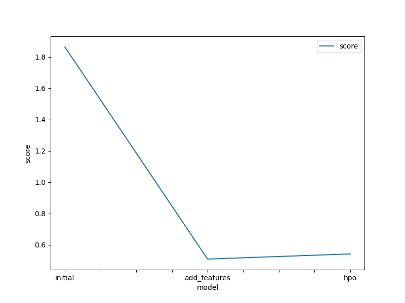

# Report: Predict Bike Sharing Demand with AutoGluon Solution
#### Auther: Soya AOKI

## Initial Training
### What did you realize when you tried to submit your predictions? What changes were needed to the output of the predictor to submit your results?
It was needed that negative values replacement with zeros to submission, and a presets parameter change to "medium_quality_faster_train" from "best_quality" like `TabularPredictor.fit(presets="medium_quality_faster_train")` to prevent a kernel restart. And I realized AutoGluon is really great, easy to use machine learning.

### What was the top ranked model that performed?
'WeightedEnsemble_L2' (test score = 1.86412).

## Exploratory data analysis and feature creation
### What did the exploratory analysis find and how did you add additional features?
Data analysis revealed the following
- `count` increase from spring to fall and decrease through winter.
- `count` increase on `workingday`.
- `count` decrease when the weather gets bad.
- `count` has peak when temperatures are around 25°C.
- `count` has peaks at 8:00 am and 7:00 pm on `workingday`.
- `count` has peaks between 0:00 pm and 4:00 pm on NOT `workingday`.

So features of `year`, `month`, `day` and `hour` were added.

### How much better did your model preform after adding additional features and why do you think that is?
'WeightedEnsemble_L2' (test score = 0.50942). The test score improved by about 1.3 points. This is the effect of the added features.

## Hyper parameter tuning
### How much better did your model preform after trying different hyper parameters?
'WeightedEnsemble_L2' (test score = 0.54224). The test score decreased by about 0.04 points compared to the model with added features.

### If you were given more time with this dataset, where do you think you would spend more time?
The target variable `count` has a skewed distribution, so I want to spend time on pre-processing such as log conversion. I also want to properly understand the bike sharing business.

### Create a table with the models you ran, the hyperparameters modified, and the kaggle score.
|model|hpo1|hpo2|hpo3|score|
|--|--|--|--|--|
|initial|default|default|GBM - num_leaves, XGB - max_depth, CAT - depth	|1.86412|
|add_features|default|default|GBM - num_leaves, XGB - max_depth, CAT - depth	|0.50942|
|hpo|default|default|GBM - num_leaves, XGB - max_depth, CAT - depth	|0.54224|

### Create a line plot showing the top model score for the three (or more) training runs during the project.

### Create a line plot showing the top kaggle score for the three (or more) prediction submissions during the project.

## Summary
AWS and AutoGluon were used to forecast demand for bike sharing. Hyperparameter tuning was performed on the baseline model by adding features that leverage insights from EDA. A WeightedEnsemble_L2 model with a best score of 0.50942 was obtained.